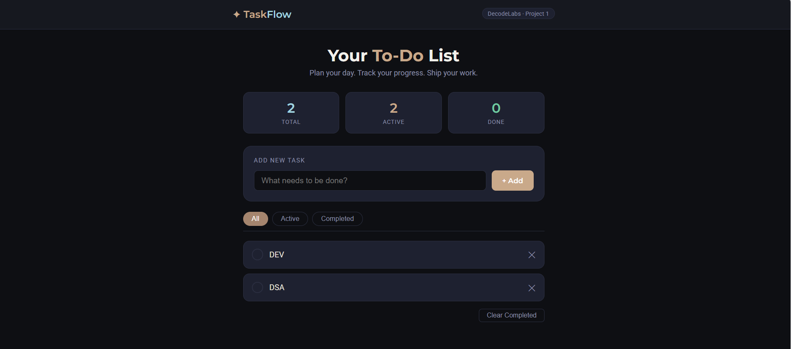
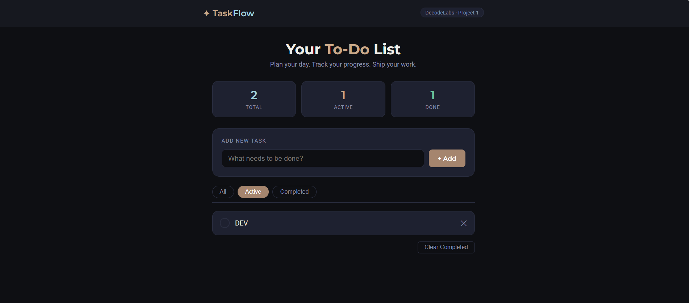
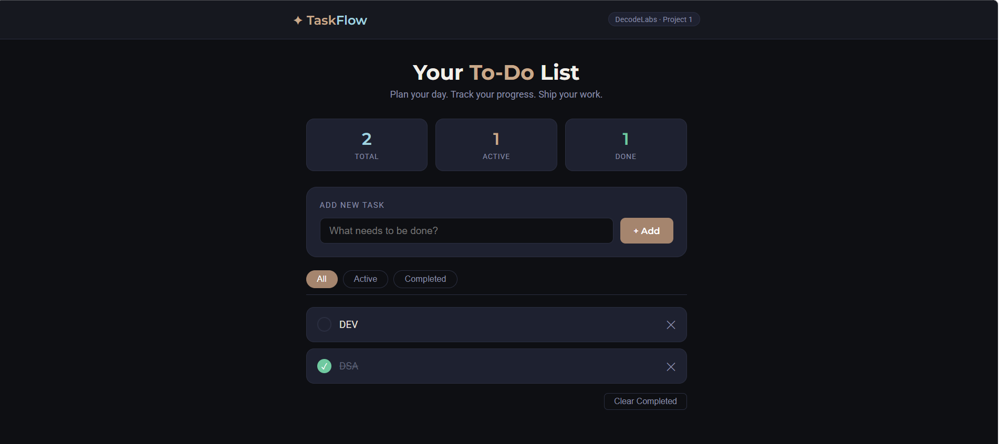
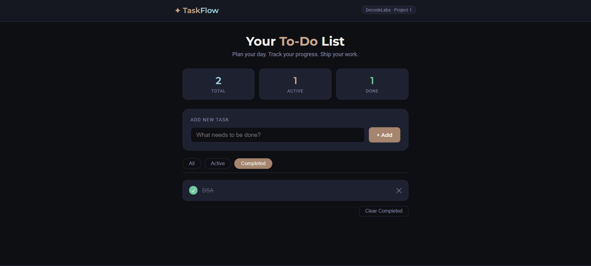

# Task 01 - To Do List Application

## Description

A simple and responsive To Do List application built using HTML, CSS, and JavaScript. This project helps users organize and manage their daily tasks efficiently.

## Features

* Add new tasks
* Mark tasks as completed
* Delete tasks
* Easy-to-use interface
* Responsive design

## Technologies Used

* HTML5
* CSS3
* JavaScript

## Screenshots

### Screenshot 1

### Screenshot 2

### Screenshot 3

### Screenshot 4

## Author

K.Santhoshini Mogaveera

